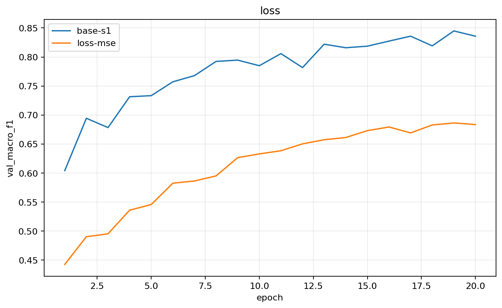
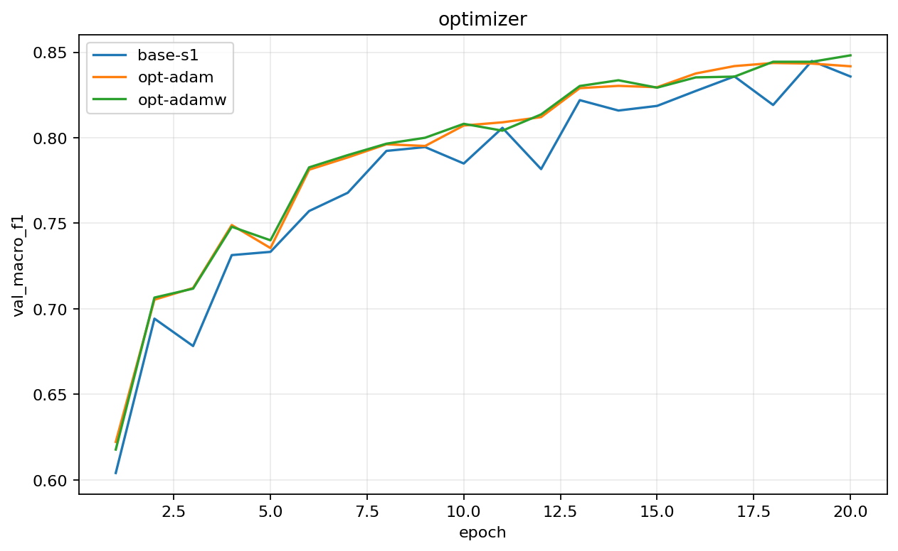
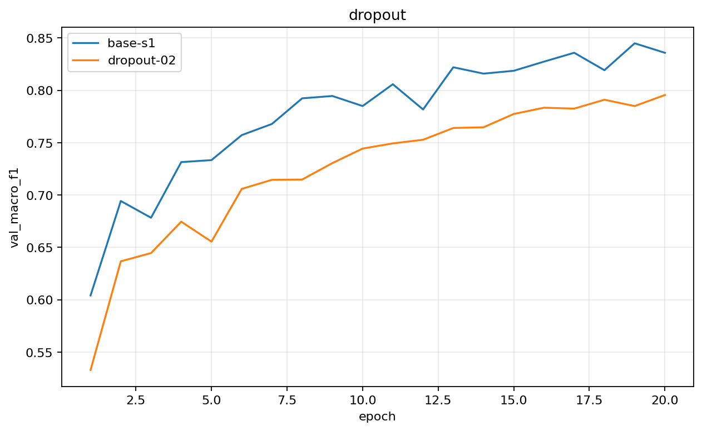
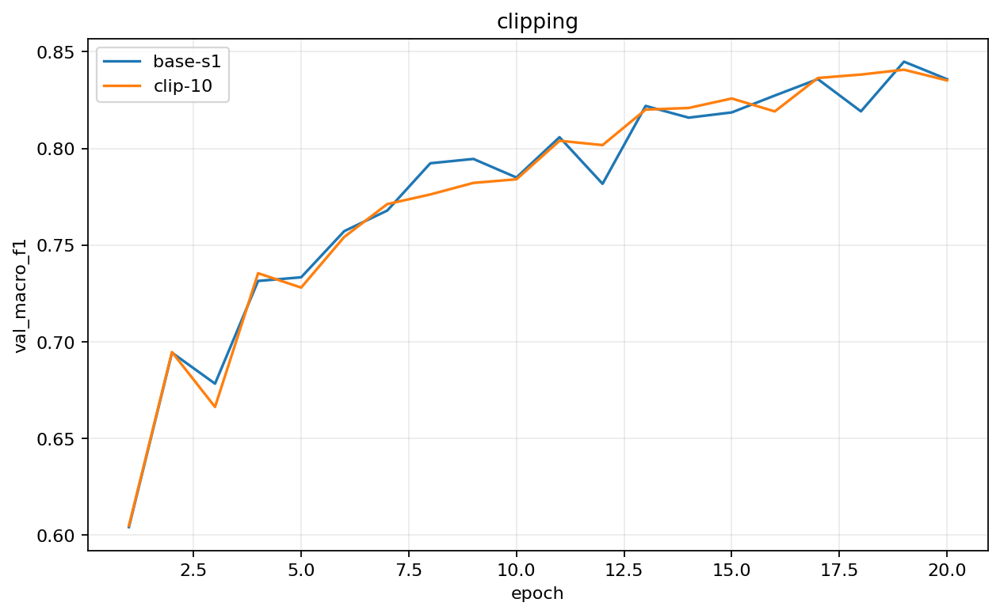
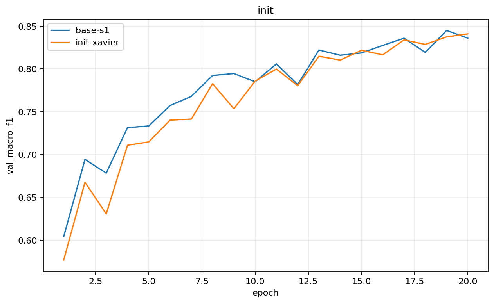

# Báo cáo Lab Day 1 - Trần Ngọc Khuyến - 2A202602682

## 1. Thiết lập

Thí nghiệm chạy trên Google Colab, GPU Tesla T4, PyTorch 2.11.0+cu130. Dữ liệu Forest CoverType được chia cố định thành 464.809 mẫu train và 116.203 mẫu eval. Tôi tách validation 20% từ train bằng stratified split, seed 42, thu được 371.847 train và 92.962 validation. Thống kê chuẩn hóa 10 thuộc tính số chỉ được fit trên training subset; 44 thuộc tính one-hot được giữ nguyên.

Model M-base là `54→256→128→7`, ReLU sau lớp ẩn, logits không qua softmax, tổng cộng 47.879 tham số. Baseline dùng CE, SGD momentum 0,9, LR 0,05, batch 512, 20 epoch, He init, FP32, không dropout/clipping. Metric chính là macro-F1 vì accuracy của chiến lược luôn đoán lớp phổ biến nhất đã là 0,4876. Tôi thử 5 chủ đề: loss, optimizer, dropout, clipping và initialization; không thử hyper-parameter hay mixed precision.

## 2. Kiểm tra ban đầu và độ nhiễu

| Kiểm tra | Kết quả |
|---|---:|
| Tham số / shape logits | 47.879 / `(B,7)` |
| Loss bước 0 sanity check / ln 7 | 2,0145 / 1,9459 |
| Overfit 20 mẫu: loss đầu → cuối | 2,1191 → 0,00000163 |
| Baseline val accuracy, TB ± σ | 0,9003 ± 0,0033 |
| Baseline val macro-F1, TB ± σ | 0,8432 ± 0,0042 |

Loss ban đầu cùng bậc với ln 7 nhưng không bằng chính xác vì He init tạo logits ngẫu nhiên không đồng đều. Việc fit 20 mẫu tới loss gần 0 xác nhận model, loss, autograd và optimizer có thể học.

Ba seed `base-s1/s2/s3` đạt val macro-F1 lần lượt 0,8449; 0,8385; 0,8463. Tôi dùng `2σ=0,0083` làm ngưỡng nhiễu: chênh lệch nhỏ hơn mức này chưa đủ bằng chứng. Train/val loss baseline cùng giảm, khoảng cách cuối khoảng 0,020, cho thấy overfit nhẹ nhưng chưa nghiêm trọng (xem `figures/base-s1.png` đến `base-s3.png`). Hạn chế: notebook chưa lưu riêng đường cong overfit 20 mẫu và chưa in gradient của từng tham số.

## 3. Kết quả theo chủ đề

### 3.1 CE và MSE

**Dự đoán:** CE tốt hơn vì trực tiếp tối ưu xác suất lớp đúng và vẫn cho gradient mạnh khi dự đoán sai tự tin.

`base-s1` (CE) đạt macro-F1 0,8449, accuracy 0,8971; `loss-mse` chỉ đạt 0,6834 và 0,8548. Chênh lệch −0,1615 vượt xa nhiễu. Không so trực tiếp loss CE 0,2554 với MSE 0,0325 vì khác thang đo. Gradient norm cuối của MSE khoảng 0,108, nhỏ hơn baseline 0,771, phù hợp với cập nhật yếu hơn. Xem `figures/compare_loss.png`.

### 3.2 Optimizer

**Dự đoán:** Adam/AdamW có thể nhanh ở đầu, còn SGD momentum bắt kịp sau đủ epoch.

| exp_id | Optimizer | LR | Best epoch | Val macro-F1 |
|---|---|---:|---:|---:|
| `base-s1` | SGD momentum | 0,05 | 19 | 0,8449 |
| `opt-adam` | Adam | 0,001 | 18 | 0,8437 |
| `opt-adamw` | AdamW, wd=0,0001 | 0,001 | 18 | 0,8444 |

Mọi chênh lệch đều nhỏ hơn 2σ, nên không có optimizer thắng rõ. Cả ba đều tối ưu tốt MLP nhỏ trên dữ liệu đã chuẩn hóa. Hạn chế quan trọng là mỗi optimizer chỉ dùng một LR; đây không phải so sánh sau tuning công bằng. AdamW có F1 epoch cuối 0,8482, nhưng checkpoint được chọn thống nhất theo val loss tại epoch 18. Xem `figures/compare_optimizer.png`.

### 3.3 Dropout

**Dự đoán:** do baseline chỉ overfit nhẹ, dropout 0,2 có thể regularize quá mạnh.

`dropout-02` đạt macro-F1 0,7955, thấp hơn `base-s1` 0,0494, vượt nhiễu theo chiều xấu. Khoảng cách val–train loss giảm từ 0,0196 xuống 0,0075 nhưng cả hai loss cao hơn: đây là underfitting, không phải tổng quát hóa tốt hơn. Dropout chỉ nên dùng khi train tiếp tục tốt lên còn validation xấu đi rõ. Xem `figures/compare_dropout.png`.

### 3.4 Gradient clipping

**Dự đoán:** nếu gradient thường dưới 1, clip norm 1 ít tác động.

`clip-10` đạt macro-F1 0,8407, thấp hơn `base-s1` 0,0042 và nằm trong nhiễu. Gradient norm trung bình cuối 0,781 dưới ngưỡng 1; baseline cũng không diverge. Clipping dùng để giới hạn bước cập nhật khi gradient bùng nổ, không tự cải thiện model ổn định. Tôi chưa chạy cặp LR cao có/không clip, nên chưa chứng minh khả năng “cứu” huấn luyện. Xem `figures/compare_clipping.png`.

### 3.5 Initialization

**Dự đoán:** He phù hợp ReLU; Xavier vẫn học được nhưng không chắc tốt hơn.

`init-xavier` có step-0 loss 2,0222, gần ln 7 hơn `base-s1` (2,2691), nhưng macro-F1 0,8409 so với 0,8449. Chênh lệch nằm trong nhiễu. Loss bước 0 tốt là sanity check, không đảm bảo metric cuối cao. He dùng phương sai gần `2/fan_in` để bù việc ReLU loại khoảng nửa activation; Xavier cân bằng fan-in/fan-out. Zero init không được đo; về lý thuyết nó không phá đối xứng giữa neuron. Xem `figures/compare_init.png`.

## 4. Đánh giá cuối trên eval

`base-s3` được chọn hoàn toàn bằng validation vì có summary macro-F1 cao nhất. Đây vẫn là baseline, chỉ khác seed; `base-s1` là mốc đối chiếu.

| Cấu hình | Seed | Val macro-F1 | Eval macro-F1 | Eval accuracy |
|---|---:|---:|---:|---:|
| `base-s1` | 1 | 0,8449 | 0,8484 | 0,8964 |
| `base-s3` (nộp) | 3 | 0,8463 | **0,8527** | **0,9027** |

Cải thiện eval 0,0043 nhỏ hơn 2σ, nên nhiều khả năng là dao động seed, không phải cải tiến kỹ thuật. Val và eval F1 của cấu hình nộp lệch 0,0064, không cho thấy distribution shift lớn.

### 4.1 Phân tích lỗi theo lớp

| Lớp | Support | Precision | Recall | F1 |
|---:|---:|---:|---:|---:|
| 0 | 42.368 | 0,9025 | 0,8975 | 0,9000 |
| 1 | 56.661 | 0,9118 | 0,9259 | 0,9188 |
| 2 | 7.151 | 0,9017 | 0,8719 | 0,8865 |
| 3 | 549 | 0,8050 | 0,8197 | 0,8123 |
| 4 | 1.899 | 0,8089 | 0,6998 | **0,7504** |
| 5 | 3.473 | 0,7771 | 0,7999 | 0,7883 |
| 6 | 4.102 | 0,9440 | 0,8830 | 0,9125 |

Lớp khó nhất là lớp 4: trong 1.899 mẫu, 1.329 đúng nhưng 447 bị nhầm thành lớp 1 và 68 thành lớp 0. Recall thấp do lớp này ít mẫu hơn nhiều và có thể chồng lấn đặc trưng địa hình với lớp phổ biến. Nhầm lẫn tuyệt đối lớn nhất là 0→1 (4.111 mẫu) và 1→0 (3.583). Một hướng cải thiện là class-weighted CE hoặc balanced sampler, chọn trọng số chỉ bằng validation.

Ma trận nhầm lẫn (hàng thật, cột dự đoán):

| |0|1|2|3|4|5|6|
|---:|---:|---:|---:|---:|---:|---:|---:|
|0|38025|4111|3|0|31|8|190|
|1|3583|52462|154|0|272|165|25|
|2|11|235|6235|87|7|576|0|
|3|0|0|65|450|0|34|0|
|4|68|447|41|0|1329|14|0|
|5|16|236|417|22|4|2778|0|
|6|432|48|0|0|0|0|3622|

## 5. Trả lời câu hỏi dẫn dắt

1. **Optimizer nào thắng?** Không có bằng chứng: SGD momentum, Adam, AdamW khác nhau dưới nhiễu; LR chưa được sweep công bằng.
2. **Dropout có giúp không?** Không. Nó giảm gap nhưng gây underfitting. Chỉ nên dùng khi có bằng chứng overfit rõ.
3. **Clipping giải quyết gì?** Nó giới hạn global gradient norm khi gradient bùng nổ. Ở LR 0,05 gradient ổn định nên không giúp đáng kể.
4. **He và Xavier?** He phù hợp ReLU nhờ `2/fan_in`; Xavier cân bằng fan-in/out. Cả hai học được và chênh lệch nằm trong nhiễu. Zero init làm các neuron đối xứng.
5. **Ba kiểm tra đầu tiên khi loss không giảm:** (i) kiểm tra shape/dtype/nhãn, chuẩn hóa và cặp logits–loss; (ii) thử overfit 20 mẫu để cô lập lỗi pipeline; (iii) kiểm tra mọi gradient hữu hạn, optimizer nhận đúng tham số và trọng số thực sự đổi sau `step()`. Sau đó mới sweep LR và đọc đường cong.

## 6. Hạn chế và điều bất ngờ

- Adam/AdamW không vượt SGD, nhưng LR chưa được tune nhiều mức.
- Cấu hình cuối vẫn là baseline seed 3; tăng eval 0,0043 không vượt nhiễu.
- Chỉ baseline chạy ba seed; các thí nghiệm khác chỉ một seed.
- Chưa thử hyper-parameter, mixed precision, zero/normal init hoặc class weighting.
- Clipping chưa được kiểm tra ở LR cao; ngưỡng 1 chưa chọn từ phân vị gradient spike.
- Checkpoint chọn theo val loss dù metric chính là macro-F1; quy tắc nhất quán nhưng có thể bỏ qua epoch F1 cao hơn.

Nếu có thêm thời gian, tôi sẽ sweep ít nhất hai LR cho mỗi optimizer, chạy cấu hình thắng ba seed, thử weighted CE cho lớp hiếm và so FP32/FP16 về tốc độ, bộ nhớ.

## 7. Phụ lục

Submission gồm báo cáo, bảng `experiments.xlsx`, dự đoán và kết quả eval, 9 JSON, 9 ảnh thí nghiệm, 5 ảnh so sánh và toàn bộ code/notebook. Tổng thời gian train xấp xỉ 9×20×(1,3–1,5) giây, khoảng 4–5 phút, chưa tính chuẩn bị dữ liệu và evaluation.
